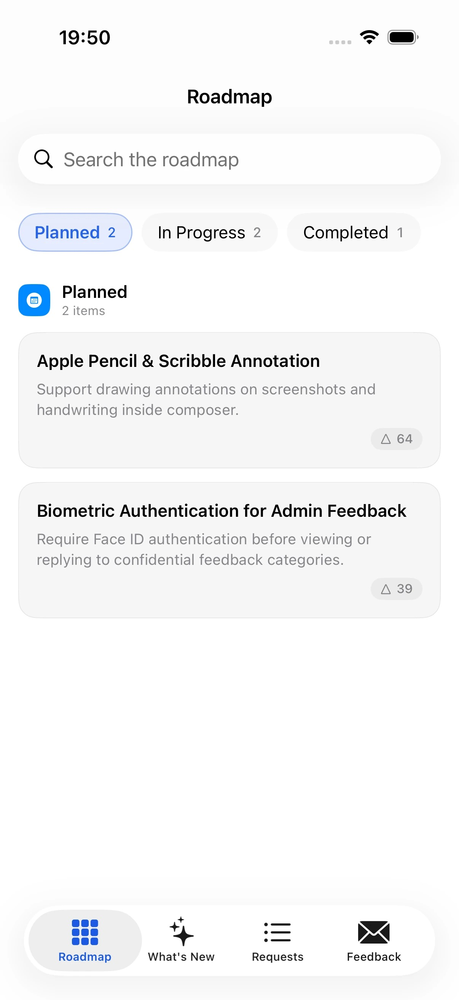
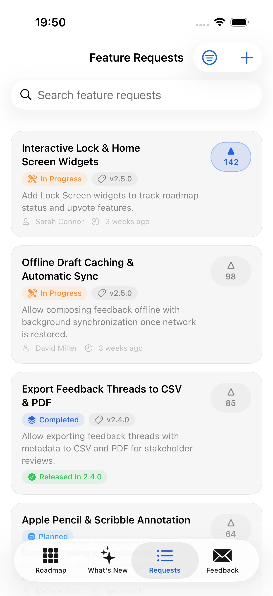
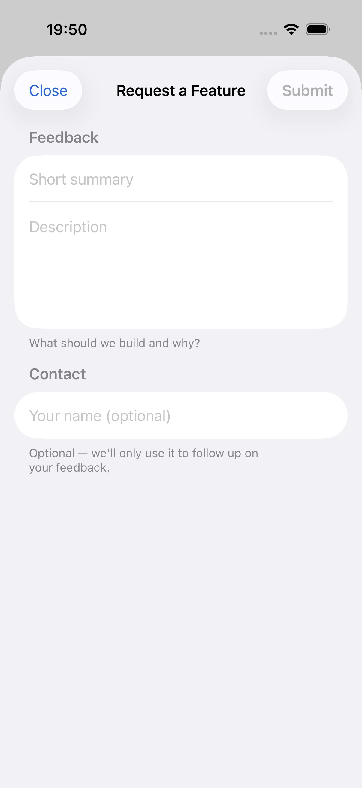
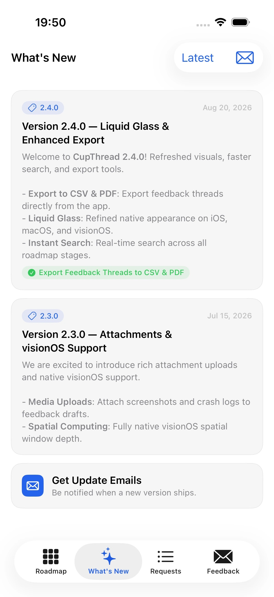
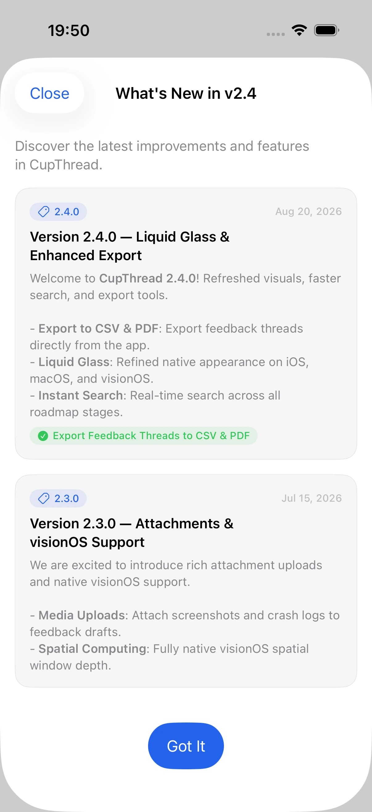
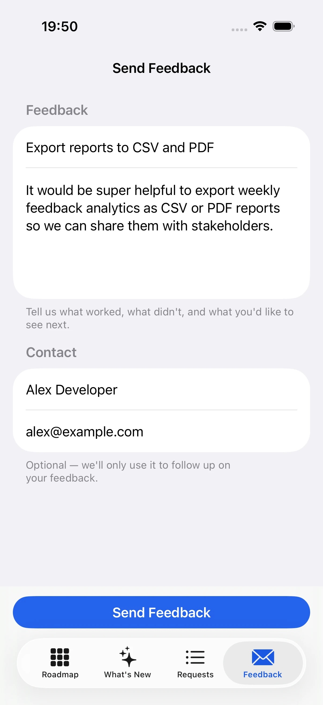

# CupThread Apple SDK

SwiftUI-based SDK for Apple platforms: **iOS 17+, macOS 14+, visionOS 1.0+, tvOS 17+** (additive — one package, platform-adaptive views).

Part of the [CupThread.com](https://cupthread.com) platform.

## CupThread Ecosystem
- 🌐 [CupThread.com](https://cupthread.com) — Feedback SaaS platform, developer console, and API.
- 🍏 [CupThread/CupThreadSwiftSDK](https://github.com/CupThread/CupThreadSwiftSDK) — Apple platform SDK (SwiftUI / SPM / XCFramework).
- 🤖 [CupThread/CupThreadAndroidSDK](https://github.com/CupThread/CupThreadAndroidSDK) — Android SDK (Jetpack Compose / Maven).
- 🧠 [CupThread/CupThreadAgenticCoding](https://github.com/CupThread/CupThreadAgenticCoding) — AI-friendly CLI & Skills for pair programming.

---

## Visual Showcase

| **Roadmap Board** | **Feature Requests** | **Submit Request** |
| :---: | :---: | :---: |
|  |  |  |
| Kanban columns, stage chips & vote counts | Optimistic voting, search & version filter | User request compose sheet |

| **What's New / Changelog** | **Changelog Modal Overlay** | **Feedback Composer** |
| :---: | :---: | :---: |
|  |  |  |
| Markdown release notes & email subscribe | In-app announcement sheet with custom copy | Structured feedback with auto metadata |

---

## Installation

### Swift Package Manager (Recommended)

Add the package dependency in your `Package.swift`:

```swift
dependencies: [
    .package(url: "https://github.com/CupThread/CupThreadSwiftSDK.git", from: "0.1.0")
]
```

Or add `https://github.com/CupThread/CupThreadSwiftSDK.git` via Xcode (File > Add Package Dependencies...).

### Prebuilt Binary Target (XCFramework)

Prebuilt XCFrameworks are published to the CupThread CDN with immutable caching:

```swift
// Package.swift
targets: [
    .binaryTarget(
        name: "CupThreadFeedback",
        url: "https://cdn.cupthread.com/sdks/apple/CupThreadFeedback-0.1.0.xcframework.zip",
        checksum: "ae48499974c5d21d1b33a17831d12f00a52b218654530ae8cfecb796c8d66bcf"
    )
]
```

Or download the zip directly from [Releases](https://github.com/CupThread/CupThreadSwiftSDK/releases) and drag `CupThreadFeedback.xcframework` into your Xcode target's *Frameworks, Libraries, and Embedded Content*.

---

## Quick Start

```swift
import SwiftUI
import CupThreadFeedback

let client = FeedbackClient(
    configuration: FeedbackClientConfiguration(
        baseURL: URL(string: "https://api.cupthread.com")!,
        appKey: "app_xxx"            // from your CupThread Developer Console
    )
)
let userToken = UserTokenStore.shared.token  // stable anonymous UUID
```

`FeedbackPlatform.current` reports the running OS automatically (`ios`, `macos`, `visionos`, `tvos`).

---

## Ready-Made SwiftUI Views

All views adapt per platform (tvOS uses focus-friendly layouts; visionOS and macOS layouts match iOS).

- `RoadmapBoardView(client:userToken:)` — Kanban roadmap grouped by the app's public columns (`GET /api/v1/public/columns`), with vote counts and version badges.
- `FeatureRequestsView(client:userToken:)` — Browse, vote (optimistic), and submit feature requests.
- `WhatsNewView(client:userToken:)` — "What's New" changelog list with version badges, friendly dates, chips for shipped feature requests, and email subscription.
- `ChangelogOverlayView` / `.changelogOverlay(client:isPresented:)` — Modal sheet of latest changelog entries with developer console configured copy.
- `FeedbackComposerView(client:userToken:onSubmit:)` — Structured feedback form with attachment uploads.

```swift
CupThreadTheme(client: client) {
    NavigationStack {
        RoadmapBoardView(client: client, userToken: userToken)
    }
}

// Present the latest changelog after launch:
.changelogOverlay(client: client, isPresented: $showWhatsNew)

// Or from UIKit / button action:
try await client.presentLatestChangelog()
```

---

## API Surface

| Method | Endpoint |
| ------ | -------- |
| `submit(_:userToken:)` | `POST /api/v1/feedback` (sends `X-User-Token`) |
| `uploadAttachment(data:filename:mimeType:preferredKind:)` | `POST /api/v1/uploads/{images,r2}` |
| `fetchAppConfig()` | `GET /api/v1/public/config/{appKey}` |
| `prepareChangelogOverlay()` | Fetches config + newest changelog entries |
| `presentLatestChangelog()` | Presents overlay sheet using console copy |
| `fetchFeatureRequests(userToken:limit:offset:versionId:query:)` | `GET /api/v1/feature-requests` |
| `submitFeatureRequest(_:userToken:)` | `POST /api/v1/feature-requests` |
| `toggleVote(featureRequestId:userToken:)` | `POST /api/v1/feature-requests/{id}/vote` |
| `fetchColumns()` | `GET /api/v1/public/columns/{appKey}` |
| `fetchVersions()` | `GET /api/v1/public/versions/{appKey}` |
| `fetchChangelog()` | `GET /api/v1/public/apps/{appKey}/changelog` |
| `subscribeToChangelog(email:userToken:)` | `POST /api/v1/public/apps/{appKey}/changelog/subscribe` |
| `unsubscribeFromChangelog(email:)` | `POST /api/v1/public/apps/{appKey}/changelog/unsubscribe` |
| `updateUserAttributes(isPaying:plan:mrr:currency:userToken:)` | `PUT /api/v1/public/apps/{appKey}/user` |

---

## Documentation

The full API documentation (DocC) is published to **[cupthread.github.io/CupThreadSwiftSDK](https://cupthread.github.io/CupThreadSwiftSDK/)**.

Build it locally:

```sh
scripts/build-docs.sh docs-site
python3 -m http.server 8080 --directory docs-site   # preview at http://localhost:8080
```

The site rebuilds and deploys automatically on every push to `main` (see `.github/workflows/docs.yml`).

## Development & Testing

```sh
# Run Swift package unit tests
swift test

# Run UI tests in Demo app & generate core screenshots
xcodebuild test \
    -project Demo/CupThreadDemo.xcodeproj \
    -scheme CupThreadDemo \
    -destination 'platform=iOS Simulator,name=iPhone 16'

# Build DocC documentation site
scripts/build-docs.sh docs-site

# Release a new version (archives 7 slices, creates XCFramework zip, tags & creates release)
node scripts/release.mjs --version 0.1.1
```

## License
MIT
